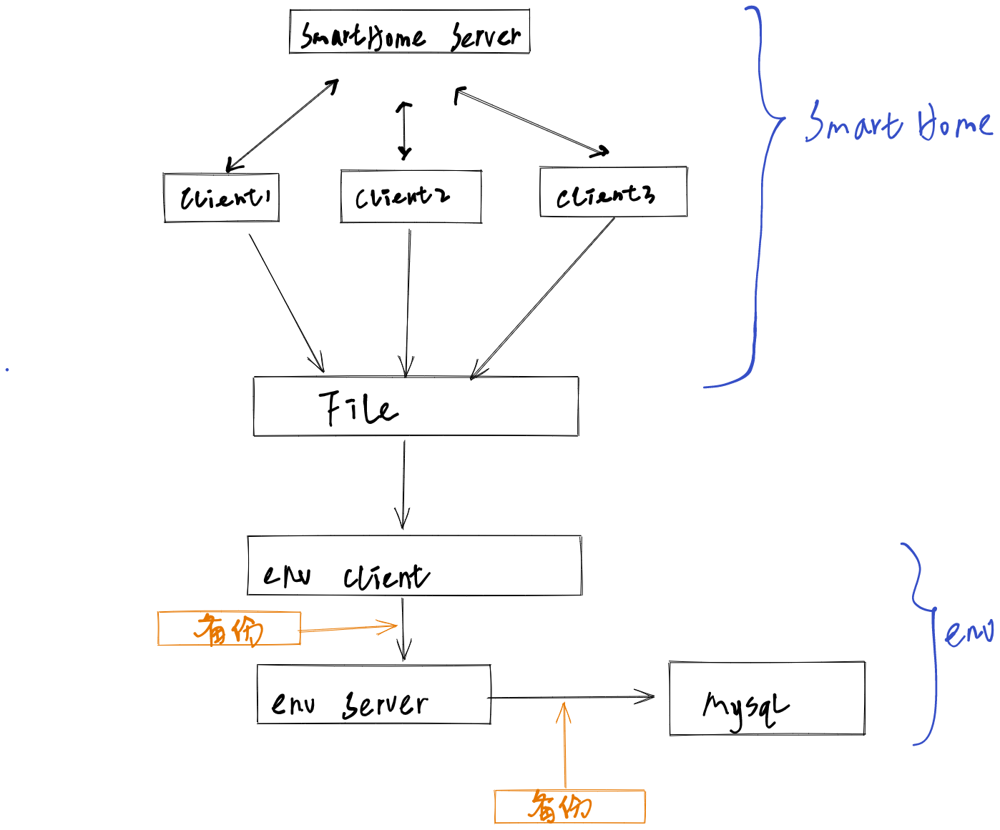
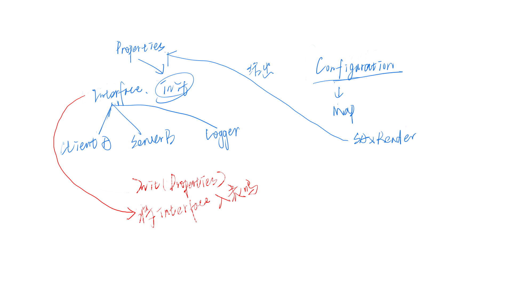

## 结构



## smart home 流程

### 客户端

1. 定时器，实时向服务器请求数据

   ```java
   TimerTask
   ```

2. 写客户端的 socket，将协议写成 String，通过字符流发送给服务器。（字节流有一个问题是如何终止阻塞？）

   ```xml
   <SensorAddress></SensorAddress>
   ```

### 服务器

1. 服务器应该进行多线程，响应多个客户端。

2. 服务器线程中读到客户端发来的数据，将 String 拼接成 xml 类型的，转换成document 对象。(是否可以直接传 document 过去？)

   ```java
   DocumentHelper.parseTest(content);
   ```

3. 遍历 document 对象，根据条件进行判断，写入相应的数据。然后将一个 xml 写成 String 类型，用字符流发回到客户端。

### 客户端

3. 接收服务器发回来的数据。
4. 进行数据处理
5. 将数据写入到一个文件中

##  env 数据入库流程

### 客户端

1. 需求是将文件数据读入，封装成一个对象（Bean，需要实现序列化接口）

2. 定义聚集的接口。

3. 实现聚集的接口

   ```markdown
   1. RandomAccessFile 随机访问流，访问到内容，split 切割数据得到一个
   2. String[] 数组
   3. 读完以后保存文件的偏移量，方法是将偏移量的值写入到一个文件中，可以用 DataOutputStream
   ```
   
4. 构造客户端 Client 服务，将集合发送到服务器

   ```markdown
   可以使用对象流去实现这个过程 `ObjectOutputStream`
   ```

### 服务器程序

1. 构建服务器接收程序，使用接口方式开发

2. 服务器依然采用多线程的方式（是否有必要）

3. 服务器获取到程序，使用 JDBC 进行入库操作

   - 在数据库中建表（尝试在 idea 中进行数据库的连接），有没有可能批量的建表。存储过程。存储过程还是相对繁琐，可以在 Java 中用 JDBC 建表啊。如果你想使用 `sql`, 可以参考我的的 sql 文件。[smarthome.sql](/sql/smarthome.sql)

   - 注意配置文件要单独拿出来

   - 使用 Java  `PreparedStatement`批量的插入数据，按日期插入相应的表。

     可以使用 Map 来存储集合数据，键使用天，值为对应天数数据的集合。时间的获得可以`Environment`元素中获得。使用 `SimpleDataFormat` 来格式化时间。

     ```java
     // SimpleDateFormat sdf = new SimpleDateFormay("dd");
     // String day = sdf.format(env.getGatherTime())
     ```

     然后根据天将相应的数据放到 Map 集合中键所对应的值的集合中，如果没有对应的天，就创建对应的天。可以使用`Map.containsKey()` 来判断对应的天是否存在。

   - 将数据写入到数据库

     ```java
     // 遍历 map 集合
     // 使用 Map.Entry<String, List<Environment>> 遍历 map
     // 可以使用 entry.getValue() 取出 entry 中的值
     ```

   - 批处理入库 `preparedStatement.addBatch()`，`preparedStatement.executeBatch()`

## 日志部分

核心组件 `Log4j`

## 备份部分

使用关键在于在什么位置备份，env 中实现备份，有两个地方：

* 客户端将 `List` 集合发送到服务器端
* 服务器端将数据发送到 MySQL 中

单独写一个备份部分的代码

拼接集合可以用 `List.addAll()`方法。

应该将客户端发送到服务器上的 List集合在 SqlHandler 中封装成 map 集合，这样在备份的时候，就比较方便，或者在 SqlHandle 中的 `insertSql` 上，
将 sql 异常抛出。
## 配置部分

写一个类去将所有的配置聚合到一起。

* Logger
* Client
* Server
* Database
* backup
* gather

感觉大概是写一个读取 xml 的方法，根据读取的配置，写一个构造需要配置的对象，比如 Client ，Server，Logger 等。

```xml
<env>
    <gather class="env.client.Imp.Example"></gather>
</env>
<!-- 写 class 可以在构造器中直接调用类名，构造对象 -->
```

```java
Class.forName(className).newInstance();
// 那用什么接收这个对象，className object ? 那怎么复用，所以给所有的对象构建一个父接口
san.getText().trim() // 可以去空格
```

将从 xml 拿到的属性，写入到 Properties，构造出来的对象放入一个 Map 集合中，方便使用。



## 关于时间转换的问题

文件的最后一部分时间是通过 `System.currentTimeMills()` 得到的。这个时间是从 1970年1月1号0时0分0秒所差的毫秒数，可以通过下面的代码进行转换。

### 转换过程

smarthome 中时间通过 `System.currentTimeMills()` 得到，写入文件中，在 env 构建 `Environment` 对象中，将 smarthome 中写入的 
`long` 类型的时间转换成了 `Date` 类型的 `Timestamp`。然后在 env 的服务器端将 `Timestamp` 类型转换成 `String` 类型。

### 相应的转换代码

```java
// 从一个 long 类型的时间转换成 Date 类型

        long time = System.currentTimeMillis();
        Calendar c = Calendar.getInstance();
        c.setTimeInMillis(time);
        System.out.println(c.getTime());
// Wed Oct 12 19:03:28 CST 202

// Date 转换成字符串形式的时间
SimpleDateFormat sim = new SimpleDateFormat("yyyy-MM-dd");
System.out.println(sim.format(c.getTime()));

// 2022-10-12
```

至于在 `Environment` 对象中封装的时间是 `Timestamp` 类型的，它继承自 `java.util.Date`类，可以用上面的类型转换。当然 `Timestamp` 自带了一个方法，`toLocalDateTime()`，可以将一个 `long ` 类型的时间转换成 `Date`类型的。

```java

		Tmestamp timestamp = new Timestamp(System.currentTimeMillis());
        System.out.println(timestamp.getTime()); // 得到一个 long 类型的
        System.out.println(timestamp.toLocalDateTime()); // 得到一个 Date 类型的
 
```


## 关于温度，湿度计算并转换的问题

1. 温度：18—25°C，相对湿度：45—65％RH

   * 计算公式：
     
     * 温度:((float)value＊0.00268127)-46.85
     
     * 湿度:((float)value*0.00190735)-6

   * 温度

     ```text
     将 18 带入 计算公式
     value * 0.00268127 - 46.85 = 18
     可以求出生成随机数的下界 24187
     同理可求得上界 26797
     ```

     生成区间 24187-26797 的数据，可以这样写

     ```java
     new Random().nextInt(2611) + 24187
     ```

   * 湿度同理


